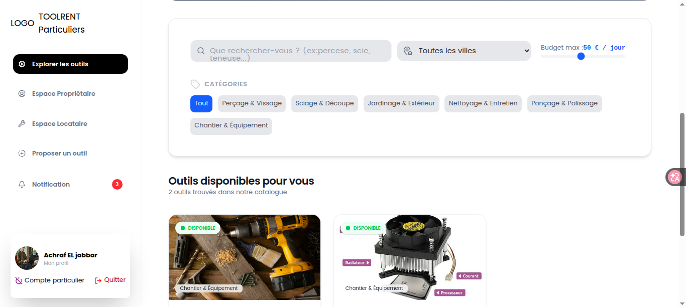
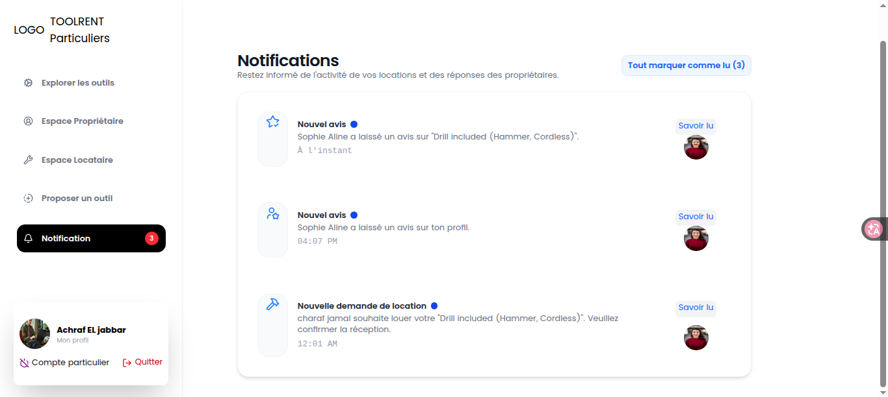
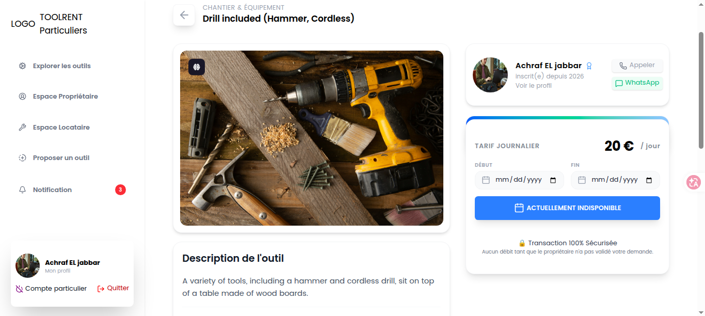
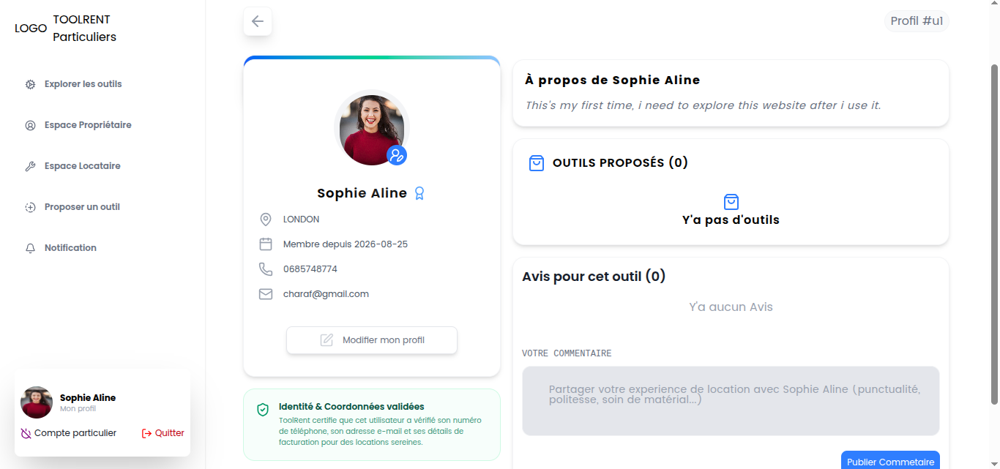
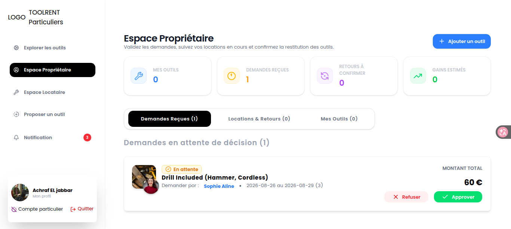
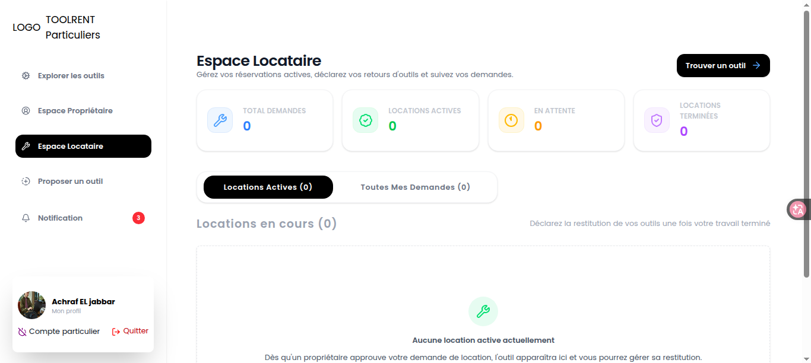

# RentTool Frontend

Frontend application for a tool rental platform built with **React, TypeScript, Redux Toolkit, and Socket.IO**.

RentTool allows users to browse and manage rental tools, send and manage rental requests, receive real-time notifications, manage their profiles, and review tools and users.

## 🚀 Features

### 🔐 Authentication

- User registration and login
- Authentication state management
- Protected application routes
- Token-based authentication
- Guest and authenticated navigation

### 🛠️ Tool Management

- Browse available tools
- Search and filter tools
- Filter tools by category and city
- View detailed tool information
- Add tools
- Manage owned tools
- View tool owner information

### 🤝 Rental Management

The application provides different rental workflows for **renters** and **owners**.

#### Renter

- Send rental requests
- View pending requests
- View approved requests
- Track active rentals
- View completed rentals
- View rejected requests
- View returned rentals

#### Owner

- View owned tools
- Receive rental requests
- Approve or reject requests
- Track active rentals
- Manage returns
- View rental statistics

### 🔔 Real-Time Notifications

The application uses **Socket.IO** for real-time communication.

Users can receive real-time updates without manually refreshing the application.

### 👤 Profile Management

- View user profiles
- Update profile information
- View owned tools
- View user reviews

### ⭐ Reviews

The application supports two review systems:

- Tool reviews
- User reviews

Users can view and manage reviews associated with tools and users.

## 🛠️ Tech Stack

- **React**
- **TypeScript**
- **Redux Toolkit**
- **React Router**
- **Axios**
- **Socket.IO Client**
- **CSS**

## 🏗️ Frontend Architecture

The project follows a feature-based architecture.

```text
src/
├── app/
│   ├── provider.tsx
│   └── store.tsx
│
├── components/
│   ├── common/
│   └── layout/
│
├── config/
│   ├── axios.ts
│   └── socket.ts
│
├── features/
│   ├── auth/
│   ├── notification/
│   ├── profile/
│   ├── rental/
│   ├── reviews/
│   └── tool/
│
├── hooks/
├── pages/
├── routes/
├── types/
└── utilis/
```

Each major application feature is isolated inside its own directory.

For example:

```text
features/
└── rental/
    ├── components/
    ├── rentalApis.ts
    ├── rentalSlices/
    ├── rentalThunks.ts
    └── rentalTypes.ts
```

This keeps API logic, Redux state, asynchronous actions, types, and UI components organized by feature.

## 🔄 State Management

The application uses **Redux Toolkit** for global state management.

Feature-specific state is separated into dedicated slices, including:

- Authentication
- Tools
- Rentals
- Notifications
- Profiles
- Tool reviews
- User reviews

Asynchronous operations are handled through Redux thunks.

## 🔌 API Integration

The frontend communicates with the backend through REST APIs using **Axios**.

API logic is organized inside individual feature modules:

```text
features/
├── auth/
│   └── authApi.ts
├── tool/
│   └── toolApi.ts
├── rental/
│   └── rentalApis.ts
├── profile/
│   └── profileApis.ts
├── notification/
│   └── notificationApis.ts
└── reviews/
```

## ⚡ Real-Time Communication

Real-time communication is handled through **Socket.IO Client**.

The frontend includes:

- Socket configuration
- Socket hook
- Real-time notification handling
- Integration with the application's notification system

```text
config/
└── socket.ts

hooks/
└── useSocket.ts
```

## 🧭 Routing

Application routing is organized using dedicated route configuration:

```text
routes/
├── AppRouter.tsx
└── routes.ts
```

The application includes separate pages for:

- Authentication
- Home
- Tools
- Tool details
- Notifications
- Profile
- Owner space
- Renter space
- Adding tools
- Not found pages

## 🎨 UI Structure

Reusable UI components are separated from feature-specific components.

```text
components/
├── common/
└── layout/
```

Feature-specific UI components are located inside their corresponding feature:

```text
features/
├── auth/components/
├── rental/components/
├── reviews/components/
└── tool/components/
```

## 📸 Screenshots

Screenshots will be added soon.

The project includes screenshots demonstrating the main application interfaces and user workflows.

## 🎥 Demo

A complete application demo video :

## Home



## Notifications



## Tool



## Profile



## Owner space



## Renter space



[](https://youtu.be/c4RoSWdzVvM?si=1HtkuDpc25_TDEzw)

The demo will showcase the main workflow:

```text
Authentication
      ↓
Browse Tools
      ↓
View Tool Details
      ↓
Send Rental Request
      ↓
Owner Receives Request
      ↓
Rental Management
      ↓
Real-Time Notifications
```

## ⚙️ Installation

Clone the repository:

```bash
git clone https://github.com/achrafjbr/RentTool-frontEnd

cd rentTool-frontend
```

Install dependencies:

```bash
npm install
```

Start the development server:

```bash
npm run dev
```

The application will then be available through the local development server.

## 🔗 Backend

This frontend application communicates with the RentTool backend API.

Backend repository:

**RentTool Backend:**
https://github.com/achrafjbr/rentTool-backend

## 📌 Project Highlights

This project demonstrates experience with:

- React application architecture
- TypeScript
- Feature-based frontend architecture
- Redux Toolkit state management
- REST API integration
- Axios
- Socket.IO real-time communication
- Authentication flows
- Role-based user experiences
- Rental workflow management
- Reusable React components
- Asynchronous state management
- Tool search and filtering
- Reviews and notifications

## 👨‍💻 Author

**Achraf El jabbar**

Frontend & Backend Developer focused on:

**React · TypeScript · NestJS · Node.js · MongoDB**

GitHub:

https://github.com/achrafjbr
